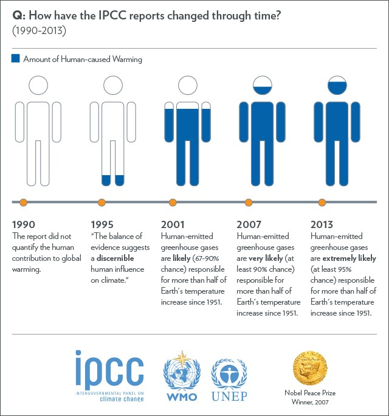
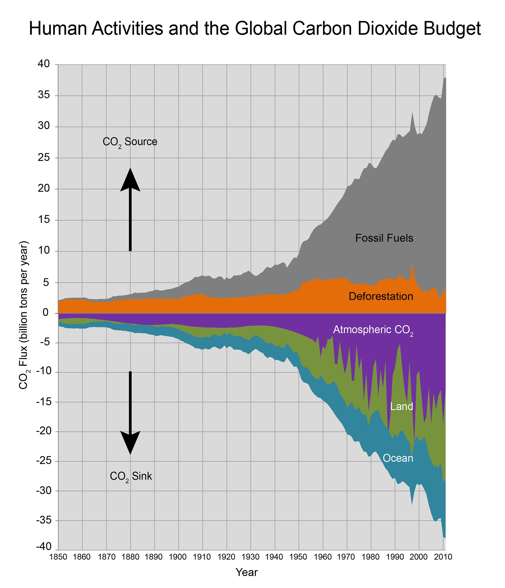
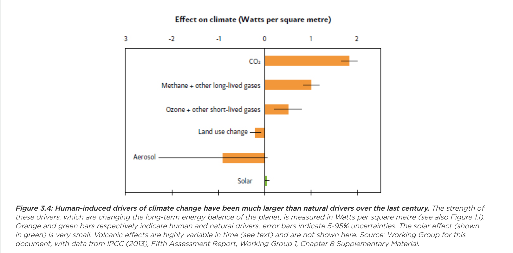
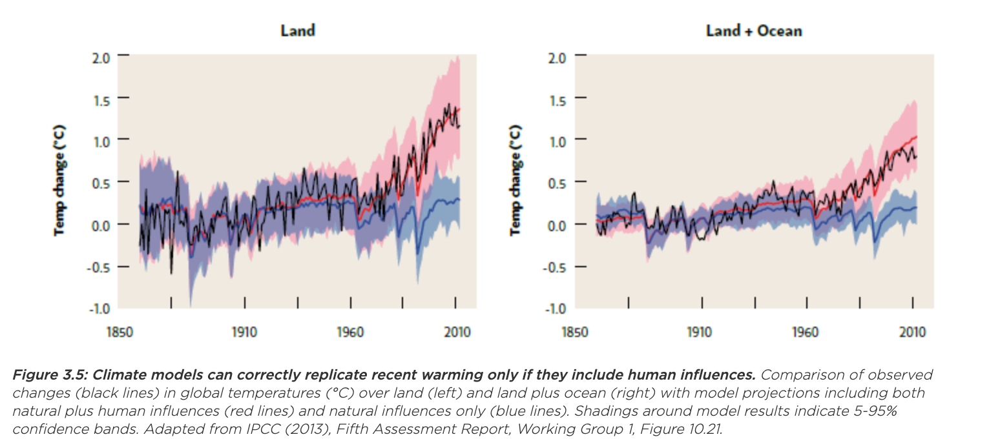
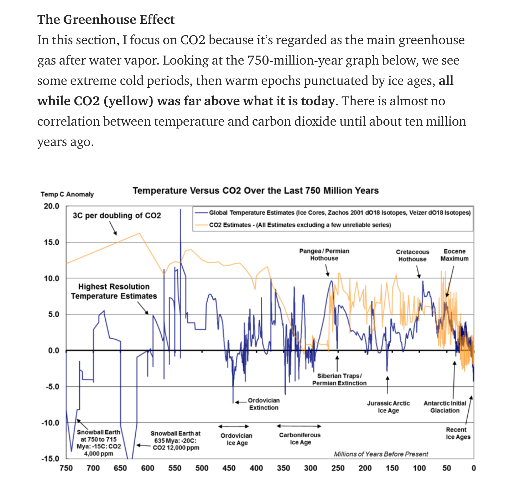
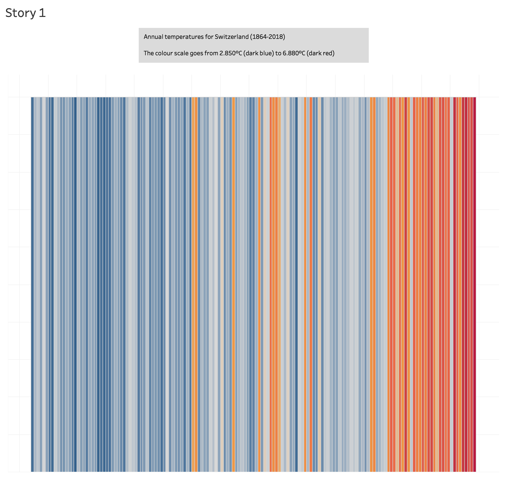

# Self study project - climate change 

## Part one

## Introduction

The self study project topic is climate change caused by human activity.Students are required to develop a literature-based evaluation framework and then use the framework to evaluate five visualizations. Second, write an overall assessment and conclusion.

## Objectives

By developing a literature-based evaluation framework, students should have knowledge about what is an effectiveness visualization, and students are eligible to create an evaluation framework. Required procedures as below:  
1. Do a literature search on what is an effective visualization
2. Select evaluation criteria and put them into a framework
3. Find five visualizations
4. Use your criteria to evaluate the visualizations
5. Write a conclusion

## Evaluation Framework

<table>
	<tr>
		<th>Graph Clarity(3)</th>
		<th>Graph Integrity(1)</th>
		<th>Graph Labeling/title(2) </th>
        <th>Visualization Color(2) </th>
        <th>Ordering(1) </th>
        <th>Accessibility(1) </th>
 	</tr>
 	<tr>
  		<td>Appropriate  explanation(1)</td>
   		<td>No exaggeration(1)</td>
        <td>No overlabel or typos(1)</td>
		<td>A single color to represent the same type of data(1)</td>
        <td>Order data hierarchy(0.5)</td>
        <td>Alternative text for images(0.5)</td>
 	</tr>
	<tr>
  		<td>No overdressing with unnecessary elements((1)</td>
   		<td> </td>
		<td>No vague/missing labels/title(1)</td>
        <td>Appropriate colors(1)</td>
        <td>Order evenly(0.5)</td>
        <td>necessary contrast and text sizes for readability(0.5)</td>
 	</tr>
	<tr>
  		<td>Easy to understand(1)</td>
   		<td> </td>
		<td> </td>
        <td> </td>
        <td> </td>
        <td> </td>
 	</tr>
</table>

## Evaluation criteria

<b>Graph clarity</b>:  The author Max Branson said in the article "EFFECTIVE DATA VISUALIZATION", graph clarity can save everybody some valuable time.I am totally agree his idea. Creating an clear visualization can help people do the heavy lifting to enhance and communicate the story. 

<b>Graph integrity</b>: Whether this results in proper estimation. "An overblown or understated message, it just misleads your audience.For example, some bars to exaggerate differences in the data, our audience loses the ability to make useful visual comparisons. On the other hand, some stretching the height of the graph can create fake drama, while stretching the width can underplay it (Geokoboard)."

<b>Graph labeling/title</b>: Readers rely on title to understand the meaning of visualization, and appropriate labels to interpret data. But remember, too much or too few labels can intefere.

<b>Visualization color</b>: Color is a great tool when used well. When used poorly, it can not just distract but misdirect the reader. Choosing appropriate colors is important."Some colors stand out more than others, giving unnecessary weight to that data"(Katy French). In addition, "use a single color to represent the same type of data. If you are depicting sales month by month on a bar chart, use a single color. But if you are comparing last year’s sales to this year’s sales in a grouped chart, you should use a different color for each year(Katy French)".

<b>Ordering</b>:Random patterns that are difficult to interpret are frustrating and detrimental to what you’re trying to communicate. Order data hierarchy means "order categories alphabetically, sequentially, or by value" (Katy French). Order evenly is also very important. "Use natural increments on your axes (0, 5, 10, 15, 20) instead of awkward or uneven increments (0, 3, 5, 16, 50)"(Katy French) is easy for readers to understand.

<b>Accessibility</b>: "Accessibility are important to take into consideration because they help a broader audience understand your graphic, including both people with and without disabilities. Alternative text means displayed when the image cannot be. Screen readers, the assistive technology used by people who are visually impaired, read alt text out loud in place of people seeing the image"(Cole Nussbaumer Knaflic, 2018). Because all five pictures I selected comes from webpage, I will right click the picture and choose 'inspect' to check whether the picture has alternative text('alt' attribute). On the other hand, necessary contrast and text sizes are important,because "we should also consider users with low vision and a variety of other conditions that affect vision"(ole Nussbaumer Knaflic, 2018). 

## Overall Assessment:

<table>
 <tr>
    <th> </th>
	<th>Graph Clarity(3)</th>
	<th>Graph Integrity(1)</th>
	<th>Graph Labeling/title(2) </th>
    <th>Visualization Color(2) </th>
    <th>Ordering(1) </th>
    <th>Accessibility(1) </th>
    <td><strong>Total Score(max 10)</strong></td>
 </tr>
<tr>
    <td><strong>Graph 1</strong></td>
   	<td>3</td>
    <td>0</td>
    <td>1.5</td>
    <td>2</td>
    <td>1</td>
    <td>0.5</td>
    <td>8</td>
 	</tr>
	<tr>
 <td><strong>Graph 2</strong></td>
   	<td>2.5</td>
    <td>1</td>
	<td>2</td>
    <td>2</td>
    <td>1</td>
    <td>1</td>
    <td>9.5</td>
</tr>
<tr>
    <td><strong>Graph 3</strong></td>
    <td>1</td>
    <td>1</td>
    <td>1</td>
    <td>2</td>
    <td>1</td>
    <td>0.5</td>
    <td>6.5</td>
</tr>
<tr><td><strong>Graph 4</strong></td>
    <td>3</td>
    <td>1</td>
    <td>1</td>
    <td>2</td>
    <td>1</td>
    <td>0.5</td>
    <td>8.5</td>
</tr>
<tr>
    <td><strong>Graph 5</strong></td>
    <td>2.5</td>
    <td>1</td>
    <td>2</td>
    <td>1</td>
    <td>1</td>
    <td>0</td>
    <td>7.5</td>
</tr>
</table>

## Assessment explaination:

### Graph 1: Amount of Human cause warming  

Source: [Graph1](https://www.ucsusa.org/global-warming/science-and-impacts/science/human-contribution-to-gw-faq.html)  

* The graph has clear explanation, clear title, no overdressing or unnecessary elements, and the visualization color is easy to read and understand.  
* Ordering is clear, the timeline is pretty clear with year order and each time period can fully represent people percentage are affected by Human-emitted green gas. 
* Graph labeling/title problem:the explanation of each time line is too long. I recommend the author list important point instead of whole sentence. 
* Graph integrity problem 1 - the size of blue area used to represent on likelihood of human causing climate changing does not align with the original data. For example, in the third bar, "2001 Human-emitted greenhouse gas are very likely (67%-90%) chance are responsible for more than half of the Earth's Temperature increase since 1951." The blue area fails to represent the range between 67%-90%.
* Graph integrity problem 2 - using inconsist bar width is misleading. Changes in the "upper body" is exaggerated compared to the "leg" area.
* Accessibility problem: No lternative text for images.

### Graph 2:  Human Activities and the Global Carbon Dioxide Budget

Source: [Graph2](https://nca2014.globalchange.gov/report/response-strategies/mitigation)   

* Everything on the graph 2 is perfect besides graph clarity. 
* I like the graph coloring and labels, because these two elements are very clear and easy to read. 
* Graph clarity problem: The explanation is a little bit confused. The two arrows on CO2 source and CO2 sink which makes me confused. The article explains that "CO2 is emitted from any source and then circulate in the land-atmosphere-ocean system, and it is finally converted into stable forms in soils, deep ocean sediments, or other geological repositories". However, the two arrows in graph cannot clear explain how the circulate in the land-atmosphere-ocean system works. 

### Graph 3:   Human-induced drivers of climate change have been much larger than natural drivers over the last century. 
Source: [Graph3](https://www.science.org.au/learning/general-audience/science-booklets-0/science-climate-change/3-are-human-activities-causing)  

* Graph clarity problem: The explanation under graph is messy, the source and definition should put in the separate line. 
* Graph Labeling/title problem 1: Titles are unclear in this graph. Is “Effect on climate change(Watts per square metre) means x-axis definition or graph title? Additionally, coordinate axis is not defined clearly.
* Graph Labeling/title problem 2: Vague labels happened in the graph. “Error bars indicate 5-95 uncertainties”, this is no clear label represent ‘error bars’,I assume the black bold line in the chart meaning it. 
* Accessibility problem: Because the solar effect (shown in green) is very small, it is really hard to read through the graph. I will recommend to choose a more contrast color instead.

### Graph 4: Climate models can correctly replicate recent warming only if they include human influences.  

Source: [Graph4](https://www.science.org.au/learning/general-audience/science-booklets-0/science-climate-change/3-are-human-activities-causing)  

* The graph has a very clear explanation how human activities affect temperature change, but still three major problems as below:
* Graph Labeling/title problem 1: Vague labels on what is the pink, purple and blue represent for? 
* Graph Labeling/title problem 2: The source and definition should put in the separate line. 
* Accessibility problem:  Model colors are not contrast enough. Stronger colors will help people to read. 

### Graph 5:  The graph is about human is not major cause of climate change  

Source: [Graph5](https://medium.com/@pullnews/what-i-learned-about-climate-change-the-science-is-not-settled-1e3ae4712ace)  

* The graph has a good example on how human activities is not affect temperature change, but still have three major problems as below:
* Graph clarity problem: Overdressing elements on graph, hard to find the important part.
* Graph labels/title problem 1: Is the arrow point the specific point or an range? Is the horizontal arrows means a range?
* Graph labels/title problem 2: Unclear title: No x-axis title.
* Accessibility problem1: Model colors are not contrast enough,stronger colors will help people to read. 
* Accessibility problem2: No lternative text for images.

## Conclusion:  
By doing an literature search on effectiveness visualization, I learned many new criteria to evaluate an effective graph. For example, graph intergrity is so important,because any underestimate or overblown will lead a mistake to audience. On the other hand, I never think about accessibility problems before. After I read "accessible data viz is better data viz" by Cole, I realized that creating an effective visualization needs to concerns many areas. For instance, an alt webpage image can help disability people to read paper. Moreover, constrast color can help color blindess people to have a better understanding of graphs.
I really like this self study project, I will use what I learned to contribute on my future visualizations. 

## Reference: 
* <b>Literature search citation</b>:  
"Play Your Charts Right." GECKOBOARD, [www.geckoboard.com/learn/data-literacy/data-visualization-tips/](http://www.geckoboard.com/learn/data-literacy/data-visualization-tips).  
     Branson, Max. "EFFECTIVE DATA VISUALIZATION." Killer infographics, 9 Mar. 2016, 
     [killerinfographics.com/blog/effective-data-visualization.html](http://killerinfographics.com/blog/effective-data-visualization.html)  
     French, Katy. "25 Tips to Instantly Improve Your Data Visualization Design." Column Five, 
     www.columnfivemedia.com/25-tips-to-upgrade-your-data-visualization-design.  
     NUSSBAUMER KNAFLIC, COLE. "accessible data viz is better data viz." storying with data, 26 June 
     2018, www.storytellingwithdata.com/blog/2018/6/26/accessible-data-viz-is-better-data-viz.  
     

* <b>Figure source citation</b>:  
Graph 1: "How Do We Know that Humans Are the Major Cause of Global Warming?" Union of Concerned Scientists, 1 
     Aug. 2017, [www.ucsusa.org/global-warming/science-and-impacts/science/human-contribution-to-gw-faq.html](http://www.ucsusa.org/global-warming/science-and-impacts/science/human-contribution-to-gw-faq.html)  
Graph 2: Jacoby, Henry D, and Anthony C Janetos. "Mitigation." Welcome to the National Climate Assessment, 
     edited by Birdsey, [nca2014.globalchange.gov/report/response-strategies/mitigation](http://nca2014.globalchange.gov/report/response-strategies/mitigation).  
Graph 3: "Are human activities causing climate change?" Australian Academic of Science, [www.science.org.au/learning/general-audience/science-booklets-0/science-climate-change/3-are-human-activities-causing](http://www.science.org.au/learning/general-audience/science-booklets-0/science-climate-change/3-are-human-activities-causing).  
Graph 4:  "Are human activities causing climate change?" Australian Academic of Science, [www.science.org.au/learning/general-audience/science-booklets-0/science-climate-change/3-are-human-activities-causing](http://www.science.org.au/learning/general-audience/science-booklets-0/science-climate-change/3-are-human-activities-causing).
Graph 5:Siegel, David. "What I Learned about Climate Change: The Science is not Settled." medium, 16 Oct.2015, [medium.com/@pullnews/what-i-learned-about-climate-change-the-science-is-not-settled-1e3ae4712ace].(http://medium.com/@pullnews/what-i-learned-about-climate-change-the-science-is-not-settled-1e3ae4712ace) 

# Part two: warming stripes

## Warming strips graph:

<b>Notification</b>: Because year 2019 includes many null values,I did not include the data in the warm strips graph.

## Dataset source:

Begert M, Frei C. 2018. "Area-mean temperatures of Switzerland." Federal Office of Meteorology and Climatology Meteoswiss, [https://www.meteoswiss.admin.ch/product/input/climate-data/swissmean/10.18751-Climate-Timeseries-CHTM-1.1-swiss.txt](https://www.meteoswiss.admin.ch/product/input/climate-data/swissmean/10.18751-Climate-Timeseries-CHTM-1.1-swiss.txt)

## Link to tableau:  
Link to [Swizerland_Temp.twb](https://github.com/Cindyli0310/Data_viz_self_study_project/blob/master/Swizerland_Temp.twb)  
